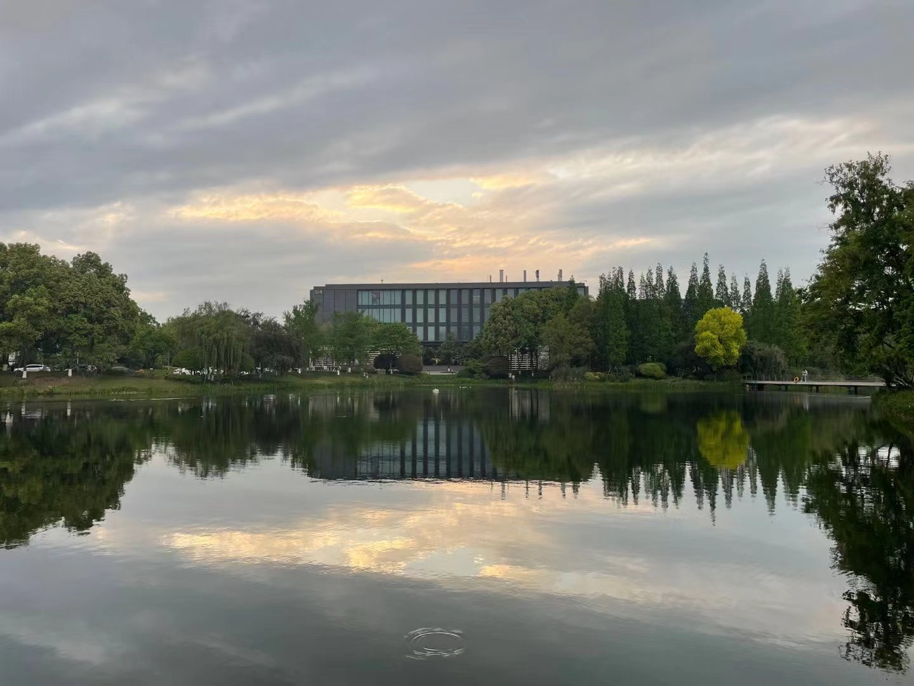

  
  

### 
I'm Sine, a Test & Quality Development Engineer 👨‍💻 from China.
  
  

- 🔭 I’m currently working on [A Byte of Vdbench](https://www.sineio.top/byte-of-vdbench), a tutorial, writing in Chinese with 💖  
  

- 🌱 I’m currently reading [Systems Performance, 2nd Edition](https://www.brendangregg.com/systems-performance-2nd-edition-book.html), written by [Brendan Gregg](https://www.brendangregg.com/).  
  

- ❓ Ask me about anything related to Benchmark Tools([COSBench](https://github.com/sine-io/cosbench-sineio), Vdbench, fio etc) and Cloud Object Storage(S3).  
  

- ⚡ I like coding, reading and travelling.  
  

   

## My Skill Set  

  
  
  
  
  
  
  
  

  

   

## Connect with me  

  

  
  

   

## Github Stats  

  

   

  

 
